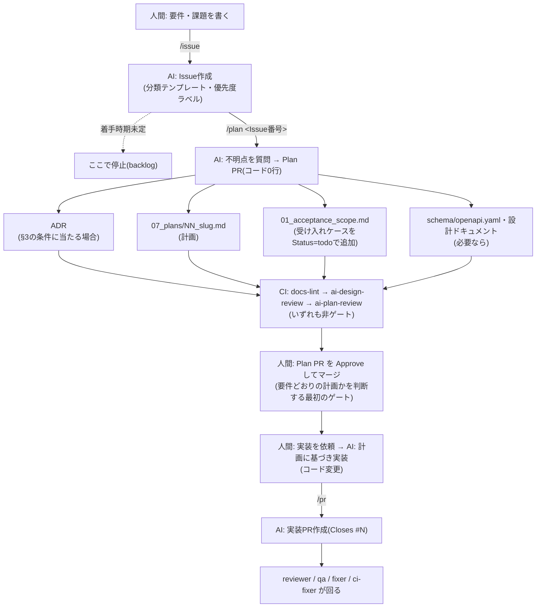
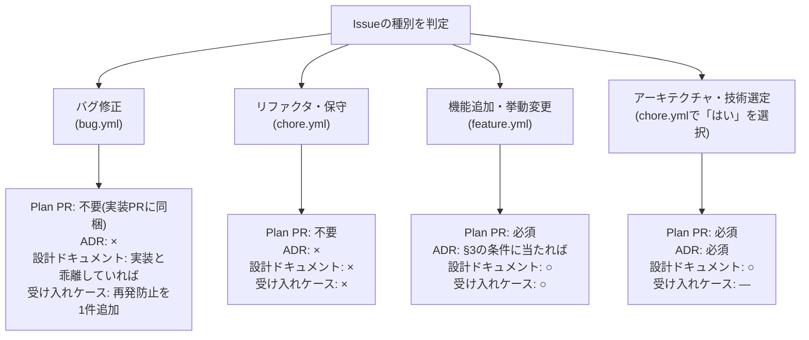
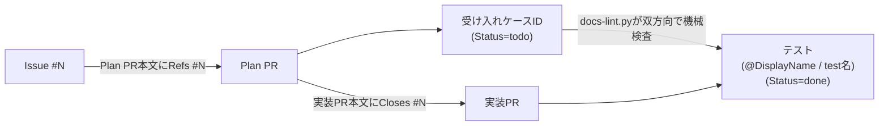

# 開発プロセス(要件 → Issue → Plan PR → 実装PR)

要件を受け取ってから実装がマージされるまでの流れと、各段階で**何を残すか**を定める。
下流(実装〜マージ)の自動化そのものは `11_cicd_design.md` が正典であり、ここでは再記述しない。
このドキュメントが扱うのは**上流(要件・仕様検討・実装計画)で生まれた判断をどこに残すか**である。

> **なぜこのプロセスにしたのか**(採用理由と却下した案)は `.claude/06_adr/` の該当ADRに記録している。

---

## 1. 全体フロー

Issue 1件に対して Plan PR 1本と実装PR 1本以上がぶら下がる。**進捗の管理単位は Issue** である。

**人間がやること**は3つに限る: 要件を書く / 質問に答える / Plan PR と実装PR を Approve する。

> **`/pr` の位置づけ**: `/pr` は「現在の作業ツリーの変更からPRを作成する」コマンドであり、実装そのものを
> 行うコマンドではない。Plan PR承認後、人間がAIに実装を依頼し(スラッシュコマンド化していない)、
> コード変更ができた状態で `/pr` を叩いてPRへ packaging する、という順序になる。



---

## 2. 分類ごとのトリガー表

「必要なら作る」では判断がぶれるため、種別ごとに固定する。**この表が Issue テンプレートの選択と対応している**。

| 種別(Issueテンプレート) | Plan PR | ADR | 設計ドキュメント更新 | 受け入れケース |
|---|---|---|---|---|
| バグ修正(`bug.yml`) | 不要(実装PRに同梱) | × | 実装と乖離していれば | 再発防止を1件追加 |
| リファクタ・保守(`chore.yml`) | 不要 | × | × | × |
| 機能追加・挙動変更(`feature.yml`) | **必須** | §3の条件に当たれば | ○ | ○ |
| アーキテクチャ・技術選定(`chore.yml` で「はい」を選択) | **必須** | **必須** | ○ | — |

- 「Plan PR 不要」の種別でも、実装が想定より大きくなった時点で Plan PR に切り替えてよい。
- 受け入れケースの追加・変更・廃止の判断は**人間のみ**が行う(`00_acceptance_policy.md` §7)。AIは案を出すところまで。

### 受け入れケースとは

`.claude/05_acceptance/01_acceptance_scope.md`(受け入れケース台帳)に1行1ケースで積む、
「どの受け入れ基準があり、どこまで実装済みか」の台帳。**仕様書ではない**(基準の一文とID・状態のみを持ち、
仕様の詳細は設計ドキュメントを参照する)。

- **ID体系**: `<コンポーネントPrefix>-AC-<3桁連番>`(例: `TRN-AC-003`)。コンポーネントはcontractテストクラス単位
- **Status**: `todo`(定義済み・未着手)→ `in_progress`(実装PRが開いている)→ `done`(受け入れテストが存在しCIで通っている)
- **優先度**: `02_severity.md` のCritical/Major/Minorに対応する P0/P1/P2(`00_acceptance_policy.md` §4)
- Plan PRで `todo` として追加 → 実装PRで対応するテストに `@DisplayName` 等でIDを埋め込み `done` に更新、が基本の流れ(詳細は§6のトレーサビリティの鎖)
- 台帳とテストの双方向の突合は `docs-lint.py`(機械検査)と `ai-qa.yml`(AIによる意味的な突合)の二段構え



---

## 3. ADRを書く条件

次のうち**1つでも当たれば ADR を書く**。当たらなければ書かない。

1. **後から覆すのが高くつく決定**(データモデル、外部サービスの採用、認証方式、レイヤー構造)
2. **複数案を比較して1つを選んだ**(=却下案がある)
3. **`CLAUDE.md` の「避けるべき落とし穴」に項目が増えるような決定**(以後この規約に従わせる、という性質のもの)

逆に、**単一の設計ドキュメントに閉じる決定は ADR にしない**。従来どおりそのドキュメント内の引用ブロックに
「決定 → 理由 → 却下案」を書く(`11_cicd_design.md` の各節がこの形式の実例)。

---

## 4. ADRの運用ルール

**配置**: `.claude/06_adr/NN_<slug>.md`(2桁ゼロ埋め連番 + snake_case)。

> **命名を勝手に変えないこと。** `docs-lint.py` の参照切れ検査は2桁プレフィックスの
> ファイル名しか認識しない。`0001_xxx.md` のような4桁にすると**検査から静かに漏れる**
> (CIは通るが、参照切れがあっても誰も気づかない)。

**必須ヘッダ**(ファイル冒頭。`docs-lint.py` が検査する):

```markdown
# NN. <決定のタイトル>

- Status: Accepted
- Issue: #42
- Date: 2026-07-31
```

| ヘッダ | 値 |
|---|---|
| `Status` | `Proposed`(Plan PR レビュー中) / `Accepted`(マージ済み) / `Superseded by NN_<slug>.md` |
| `Issue` | 起点となった Issue 番号(`#42`)。Issue を持たない場合は `なし` |
| `Date` | 決定日(ISO8601 の日付) |

**本文構成**:

```markdown
## 1. 文脈       — 何を決める必要があったか。制約は何か
## 2. 決定       — 何をどう決めたか(断定形で書く)
## 3. 却下した案 — 案ごとに「案 → 却下理由」。★このプロセスの核心
## 4. 結果       — 得たもの・引き受けたトレードオフ・撤回条件
```

**書き換えず積む**。決定を覆すときは既存ADRを編集せず、**新しいADRを起こして旧ADRの Status を
`Superseded by ...` に変える**。過去に何を考えていたかが失われると、同じ議論を繰り返すことになる。

**設計ドキュメントとの境界**:

| | 書くもの |
|---|---|
| 設計ドキュメント(`.claude/01_development_docs/` 等) | **現在の仕様**(What / How)。常に最新に保つ |
| ADR(`.claude/06_adr/`) | **決定の経緯**(Why / 却下案)。過去の記録として凍結する |

同じ内容を両方に書かない。ADR は仕様を再記述せず、該当する設計ドキュメントを参照する。

---

## 5. プランの運用ルール

**配置**: `.claude/07_plans/NN_<slug>.md`(ADRと同じ2桁連番規約。上記の命名の注意も同じ)。
**形式**: `03_feature_plan_template.md` に従う。

**必須ヘッダ**(`docs-lint.py` が検査する):

```markdown
# NN. <計画のタイトル>

- Status: planned
- Issue: #42
- PR: -
```

| Status | 意味 | `PR` |
|---|---|---|
| `planned` | Plan PR がマージされ、実装未着手 | `-` |
| `in_progress` | 実装PRが開いている | 開いているPR番号 |
| `done` | 実装がすべてマージされた(**以後編集しない**) | マージされたPR番号(複数可) |

Status と PR の更新は `/pr` が実装PRの中で行う。`done` になったプランは**凍結**し、
仕様が変わった場合はプランを書き換えず新しい Issue と Plan PR を起こす。

> **なぜ計画を残すのか**: 画面シナリオ(誰が→どの画面で→何をして→何が起きる)と UI仕様の4状態は、
> 既存の設計ドキュメントのどこにも書く場所がない(`04_screen_transition_design.md` は画面一覧と遷移図、
> `10_frontend_design.md` は設計方針)。ここを溶かすと、実装後に「物足りない」と気づく手戻りの
> 再発防止材料が失われる。

---

## 6. トレーサビリティの鎖

右端2つの突合は `docs-lint.py` が双方向で機械検査している(`00_acceptance_policy.md` §6)。
左側の Issue ↔ PR は GitHub の参照機能に任せる(`Closes` で Issue が自動クローズされる)。



---

## 7. ラベル(初回セットアップ)

`needs-human` と同じく `gh label create` で作る。リポジトリごとに一度だけ実行すればよい。

```bash
gh label create "type:bug"      --color d73a4a --description "バグ報告" --force
gh label create "type:feature"  --color 0e8a16 --description "機能追加・挙動変更" --force
gh label create "type:chore"    --color c5def5 --description "リファクタ・保守・開発プロセス改善" --force
gh label create "priority:P0"   --color b60205 --description "大会当日に運営が止まる・結果が狂う・情報が漏れる" --force
gh label create "priority:P1"   --color fbca04 --description "仕様違反・ユーザー影響のあるバグ" --force
gh label create "priority:P2"   --color ededed --description "品質・一貫性の問題" --force
gh label create "backlog"       --color 5319e7 --description "課題は記録済み・着手時期は未定" --force
```

`type:*` は Issue テンプレートが自動付与する。`priority:*` と `backlog` は
Issue フォームの選択値に応じて `/issue` が付与する(GitHub の Issue Forms は
dropdown の選択値からラベルを自動付与できないため)。

---

## 8. 運用ルール

- このプロセス自体の変更も、このプロセスに従う(Issue → ADR → Plan PR)。
- トリガー表(§2)や ADR の条件(§3)が実態と合わなくなったら、**気づいた PR で同じように更新する**
  (`01_review_checklist.md` の運用ルールと同じ発想)。
- 機械的に判定できるようになった項目は、このドキュメントの散文ではなく `docs-lint.py` に移す。
