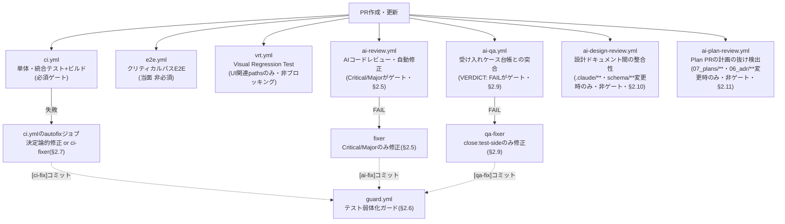
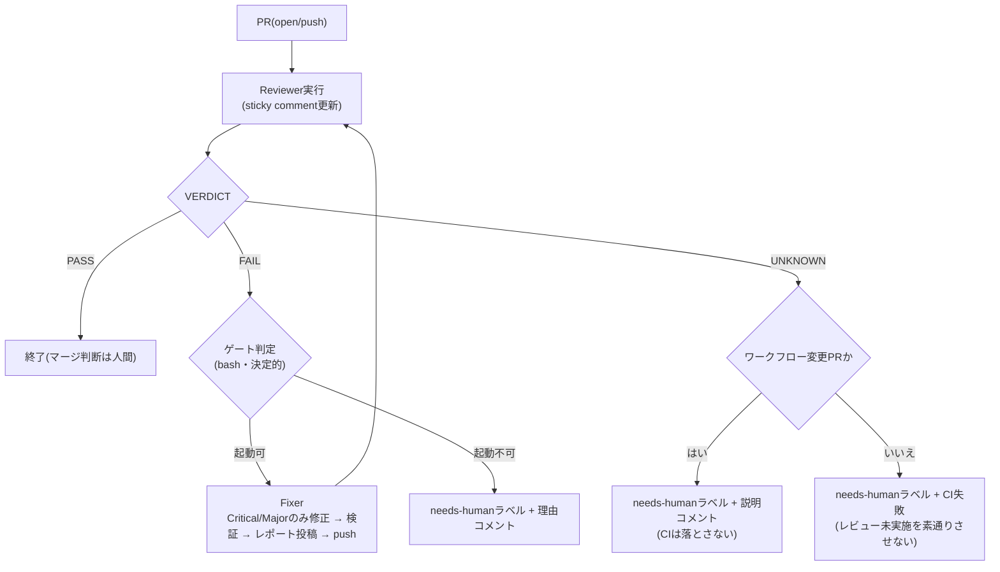
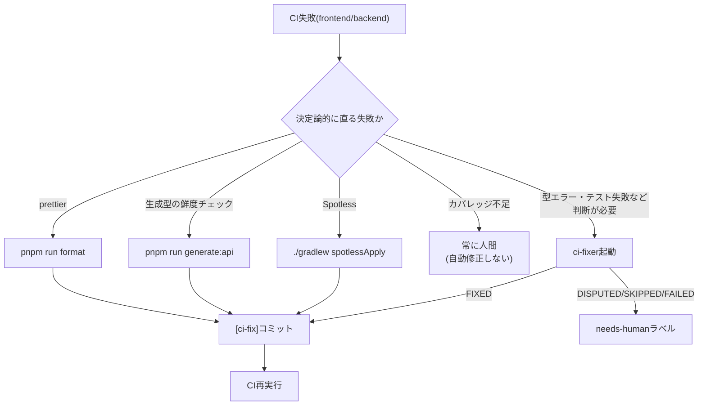
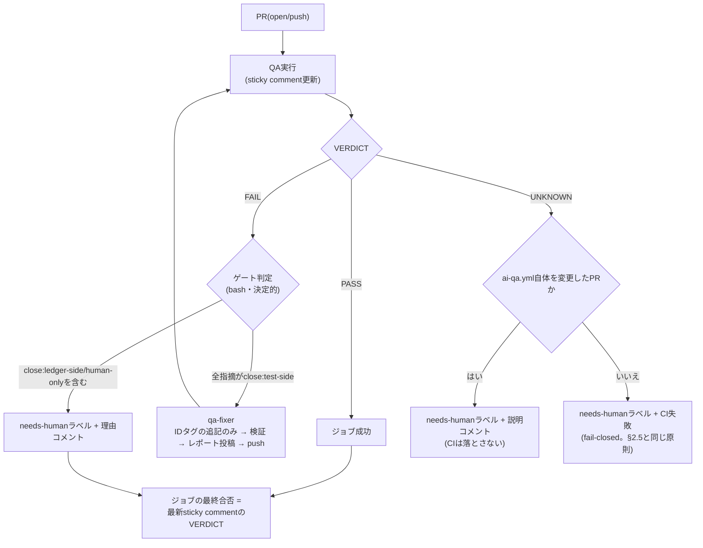
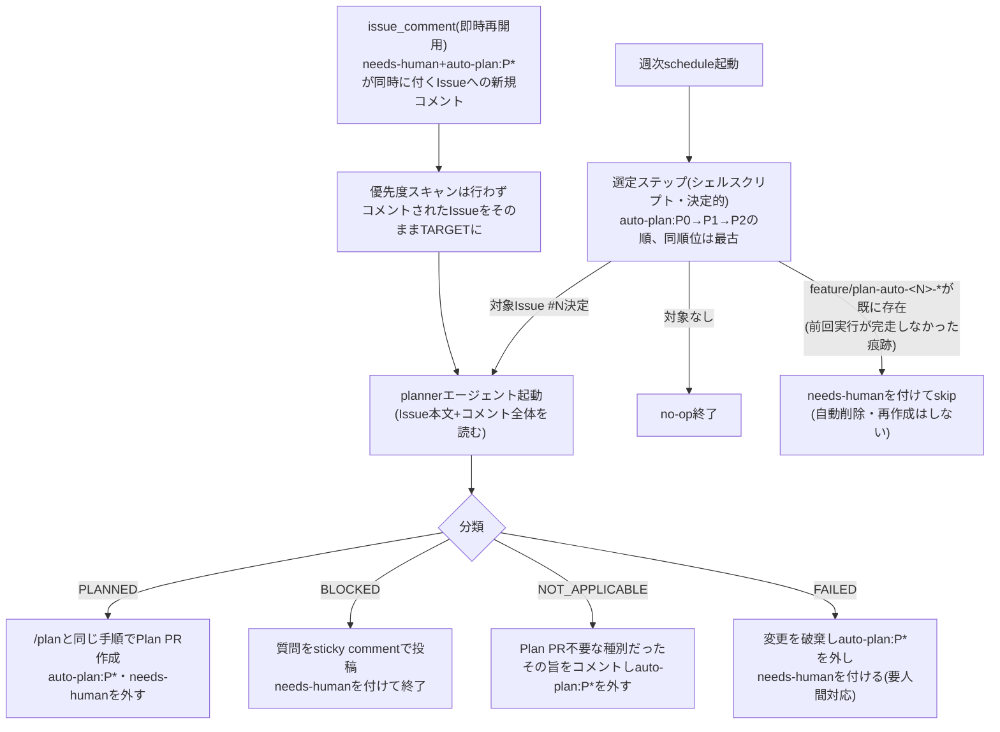

# CI/CD設計書

## 1. 基本方針

- CI: GitHub Actions(PR時に必ず実行、mainへの直接pushは禁止)
- CD: MVP期は手動デプロイ(スクリプト化)。安定後に AWS CodeDeploy 化を検討
- **「mainは常にデプロイ可能」**を守る

---

## 1.5 ワークフロー一覧

| ワークフロー | トリガー | 目的 |
|---|---|---|
| `ci.yml` | `pull_request` / `push`(main) | 単体・統合テスト、ビルド(PRごと必須。§2)+ 失敗時の決定論的な自動修正(§2.7)。**.mdのみのPRでもdocs-lintのため常に起動 |
| `e2e.yml` | `pull_request`(**.mdのみのPRを除く) / `workflow_dispatch` | クリティカルパスのE2E(Playwright)。PRごとに自動実行(当面は非required。§2.8) |
| `vrt.yml` | `pull_request`(UI関連pathsのみ) / `workflow_dispatch` | StorybookページのVisual Regression Test。**非ブロッキング**。ベースライン更新は`workflow_dispatch`のみ(§2.8) |
| `ai-review.yml` | `pull_request`(**.mdのみのPRを除く) | AIコードレビュー・自動修正(Critical/Majorのみ。§2.5) |
| `ai-qa.yml` | `pull_request`(**.mdのみのPRを除く) | 受け入れケース台帳との突合。**VERDICT: FAILはゲート**(§2.9) |
| `guard.yml` | `pull_request`(**.mdのみのPRを除く) | テスト弱体化ガード。AI自動修正の安全装置(§2.6) |
| `mutation.yml` | `workflow_dispatch` / 週次schedule | Mutation Testing(PITest、domain層限定。`09_test_strategy.md` §2.6) |
| `ai-design-review.yml` | `pull_request`(`.claude/**`/`schema/**`/`CLAUDE.md`のみ) | 設計ドキュメント間の整合性(非ゲート・レポートのみ。§2.10) |
| `ai-plan-review.yml` | `pull_request`(`.claude/07_plans/**`/`.claude/06_adr/**`のみ) | Plan PRの計画の抜け(異常系・境界・4状態・受け入れケース)を検出(非ゲート・レポートのみ。§2.11) |
| `scheduled-planner.yml` | 週次`schedule` / `workflow_dispatch` / `issue_comment` | `auto-plan:P0/P1/P2`ラベル付きIssueを1件選び、無人実行版`/plan`でPlan PRドラフトを自動作成(§2.13) |

`e2e.yml` / `ai-review.yml` / `ai-qa.yml` / `guard.yml` は、変更が `**.md`
(ドキュメントファイル)のみのPR(例: Plan PR)では起動しない(`paths-ignore`)。`.claude/`
配下はほぼ全て `.md` のため、この基準で「利用者から見た挙動を変えない純ドキュメント変更」を
実質的にカバーできる。コードを1つでも含むPRでは従来通り全ワークフローが起動する。

`ci.yml` だけは例外で `paths-ignore` を付けない。`frontend` ジョブが無条件で実行する
`docs-lint`(受け入れケース台帳のID整合・ファイル参照切れの機械検査、L64以降のYAML参照)は
`.md` のみのPR(Plan PR等)でこそ検出対象があるため、ドキュメントのみの変更でも常に起動させる
(AI Design Reviewで指摘・修正: D1 plan-pr-docs-lint-skipped-by-paths-ignore)。

全ワークフローがPRごとに自動実行される(`vrt.yml` はUI関連のpathsに限る)。ただし
**マージをブロックするのは `ci.yml` / `guard.yml` のみ**で、`e2e.yml` / `vrt.yml` は
所要時間と安定性の実績を見てから required check への昇格を判断する(§2.8)。



上記のうち `ci.yml` / `guard.yml` はマージをブロックする実線経路。`ai-review.yml` / `ai-qa.yml`
から伸びる自動修正(`fixer` / `qa-fixer` / autofix)は、いずれも `guard.yml` の検査対象になる
(破線)。詳細な分岐条件は各節の図を参照。

### `vrt.yml` の運用

- `workflow_dispatch` の入力 `update_snapshots`(boolean)で「比較のみ」と「ベースライン更新」を切り替える
- **ベースライン更新は `workflow_dispatch` のときだけ**。PRトリガーでは絶対に更新しない
  (更新されると「差分を検知せず素通り」する事故になるため、`github.event_name` を条件に明示している)
- **ベースライン更新は必ずこのワークフロー経由で行う**(ローカルではPRに含めるベースラインを生成しない。`09_test_strategy.md`)。更新時はコンテナ内でコミット・pushする
- pushは `AUTOFIX_TOKEN`(人間名義のPAT)を使う。`GITHUB_TOKEN` でpushすると
  §2.7の2問題(後続の`pull_request`実行が`action_required`で止まる/actorが`github-actions[bot]`
  になりAIレビューがブロックされる)がそのまま発生する(実測で確認済み)。`AUTOFIX_TOKEN`未設定時は
  push自体を行わずジョブを失敗させる(セットアップ手順は§2.7参照)
- `AUTOFIX_TOKEN` はcheckout時点では使わず、「Commit updated baselines」ステップでpushする直前に
  `git remote set-url` でリモートURLへ埋め込むだけにとどめる。このジョブは通常のPR比較実行時に
  PRの依存関係(`pnpm install`)とPR変更後のフロントエンドコード(Playwright/Storybook実行)を
  そのまま動かすため、書き込み権限を持つPATをチェックアウト時点から持たせると、依存関係経由の
  コード実行で窃取された場合にリポジトリへの書き込み権限が露出する(`ci.yml`のautofixジョブが
  CI失敗後のみ起動する専用ジョブとして分離されているのと異なり、`vrt.yml`は毎PR実行のジョブと
  ベースライン更新を同じジョブで扱うため、資格情報の持たせ方でリスクを避ける)。`permissions:`
  は`contents: read`のみで、pushはこの埋め込みURL経由(GITHUB_TOKENの権限とは無関係)で行う
- `actions/checkout` には `persist-credentials: false` を必ず指定する。デフォルトでは
  `GITHUB_TOKEN` 用の認証情報がgit設定(`http.extraheader`)に永続化され、これが残ったまま
  だと後続の `git remote set-url` による `AUTOFIX_TOKEN` への切り替えが効かず、
  `http.extraheader` 側の認証情報(`GITHUB_TOKEN`、`contents: read`)でpushが実行されて
  403になる(`AUTOFIX_TOKEN`自体が有効でも起きる。実例: `contents: write`→`contents: read`
  への変更後に発覚)
- 実行対象はローカル確認用の `frontend/scripts/vrt.sh` と同じPlaywright公式コンテナイメージを使う(フォントレンダリング差分を避けるため)

---

## 2. CIパイプライン(PR時)

`.github/workflows/ci.yml`

```yaml
name: CI
on:
  pull_request:
  push:
    branches: [main]

permissions:
  contents: read
  pull-requests: write # カバレッジレポートのPRコメント投稿用

jobs:
  frontend:
    runs-on: ubuntu-latest
    defaults: { run: { working-directory: frontend } }
    steps:
      - uses: actions/checkout@v4
      - uses: pnpm/action-setup@v4
        with: { package_json_file: frontend/package.json }
      - uses: actions/setup-node@v4
        with: { node-version: 20, cache: pnpm, cache-dependency-path: frontend/pnpm-lock.yaml }
      - run: pnpm install --frozen-lockfile
      - run: pnpm run lint
      - run: pnpm run type-check
      - run: pnpm run test:coverage
      - uses: davelosert/vitest-coverage-report-action@v2
        if: always() && github.event_name == 'pull_request'
        with: { working-directory: frontend }
      - run: pnpm run build

  backend:
    runs-on: ubuntu-latest
    defaults: { run: { working-directory: backend } }
    services:
      dynamodb-local:
        image: amazon/dynamodb-local:latest
        ports: ["8000:8000"]
    steps:
      - uses: actions/checkout@v4
      - uses: actions/setup-java@v4
        with: { distribution: temurin, java-version: 25, cache: gradle }
      - run: ./scripts/create-table.sh
        env: { DYNAMODB_ENDPOINT: "http://localhost:8000" }
      - run: ./gradlew check build
      - uses: madrapps/jacoco-report@v1.8.0
        if: always() && github.event_name == 'pull_request'
        with:
          paths: ${{ github.workspace }}/backend/build/reports/jacoco/test/jacocoTestReport.xml
          token: ${{ secrets.GITHUB_TOKEN }}
          title: Backend Code Coverage
          update-comment: true
          min-coverage-overall: 0
          min-coverage-changed-lines: 0
```

### ルール

- どちらかのジョブが失敗したPRはマージ禁止(ブランチ保護設定)
- E2E(Playwright)はPRごとに実行する(§2.8)。ただし当面は required check にしない
- 依存更新は Dependabot(週次、`gradle` / `pnpm` / `github-actions`)
- backendの `./gradlew check` にはSpotless(`googleJavaFormat`によるフォーマット・未使用import削除・import順序)のチェックが含まれる。frontendの `pnpm run lint` / `pnpm run format` に相当する役割(`backend/build.gradle` の `spotless { java { ... } }` 参照、`08_development_setup.md` §7)

### カバレッジ可視化(PRコメント)

- `madrapps/jacoco-report`(backend)・`davelosert/vitest-coverage-report-action`(frontend)がPRごとに「全体カバレッジ」と「PRで変更した行のカバレッジ」をsticky commentで投稿する(外部SaaSは使わずGitHub Actions内で完結)
- `min-coverage-*` は `0` にしており、CIを落とす閾値としては使わない。domain層90%の強制は既存の `jacocoTestCoverageVerification`(`backend/build.gradle`)が担う。役割は「強制はdomain層のみ・それ以外は可視化のみ」で分離している(`09_test_strategy.md` §2)

---

## 2.5 AIレビュー・自動修正(`.github/workflows/ai-review.yml`)

PRごとに `anthropics/claude-code-action@v1` でAIレビューを実行し、1ラン内で「レビュー → ゲート → 修正 → 再レビュー」を完結させる。



- **役割定義**: Reviewer = `.claude/agents/reviewer.md` / Fixer = `.claude/agents/fixer.md`。品質基準は `.claude/04_quality/`
- **ゲート(Fixer起動条件)**: 以下のいずれかに該当したらFixerを起動せず `needs-human` ラベルを付ける
  - 聖域への指摘: `backend/**/domain/service/**`(マッチング・順位計算)、`05_swiss_pairing_algorithm.md`(`SANCTUARY_PATTERN`)
  - 自動修正回数が上限(`MAX_FIX_ATTEMPTS`=3、`[ai-fix]` コミット数で計測)
  - 過去に `Fixed: <slug>` 済みの指摘が再指摘された(修正が無効)
  - レポートの形式崩れ(指摘を抽出できない)
  - レポートが存在しない(`UNKNOWN`)。この場合はCIも失敗させる
- **needs-human ラベル**: 付いている間は自動ループ停止。人間が対応してラベルを外すと再開。
  「対応」の実体(指摘を読んで妥当と判断した後の実際の修正)は §2.12 を参照
- **Fixerのpush**: pushがpull_requestイベントを発火しない環境向けに、同一ラン内でCI手動起動(`workflow_dispatch`)と再レビューを行う。発火する環境ではconcurrencyで新しいランに引き継がれる
- **マージ判断は常に人間**。PASSは「人間レビューの前処理完了」の意味

### fail-closed の原則

ゲートはレポート本文から `VERDICT:` 行を読む。レポートが見つからない場合は `UNKNOWN` となり、
**PASSではなく異常として扱う**。ここをPASS相当にすると「レビューが一度も行われていないのに
AIレビュー済みとしてマージできる」状態になり、ゲートとして意味を失う。

> **実際にこの事故が起きていた。** 当時のゲートは `VERDICT != FAIL` で素通りしていたため、
> AI Reviewは緑のまま長期間まったく機能していなかった。原因は独立に2つあった:
>
> 1. **ワークフロー検証によるスキップ** — `claude-code-action` は、実行中のワークフローファイルが
>    既定ブランチの内容と一致しない場合、実行を拒否する(PRからレビュー用ワークフローを書き換えて
>    シークレットを持ち出す攻撃を防ぐためのセキュリティ機構)。つまり
>    **`.github/workflows/**` を変更するPRはAIレビューされない**
> 2. **サブエージェントへの委譲** — Reviewerがレビュー作業をバックグラウンドのサブエージェントに
>    委譲して即座にターンを終えており、ジョブ終了と同時にそのエージェントが強制終了されるため、
>    レポートが永久に投稿されなかった

対策は2層:

1. **fail-closed**(構造): `UNKNOWN` を `needs-human` にする。原因が何であれ素通りを防ぐ。
   原因が(1)のワークフロー検証スキップである場合は**回避不能**なのでCIは落とさず、
   「人間がレビューすること」を明示するコメントに留める。それ以外はCIを失敗させる
2. **委譲の禁止**(原因2への直接対処): 各エージェントのpromptで委譲を禁止し、
   `--disallowedTools "Task,Agent"` を指定する。`ai-qa.yml` にも同じ対策を入れている

### 運用上の帰結: `ai-review.yml` 自体を変更するPRはAIレビューされない

上記(1)でAIレビューがスキップされるのは、**claude-code-actionのステップを含むワークフロー
ファイル(`ai-review.yml`)自体が既定ブランチと差分を持つ場合のみ**である。`ci.yml` /
`e2e.yml` 等、他のワークフローファイルを変更するPRは(`ai-review.yml`自体が無変更であれば)
**通常どおりAIレビューが実行される**。

> 訂正: 当初このドキュメントは「`.github/workflows/**` を変更するPRは構造的にAIレビュー
> 対象外になる」と広く記載していたが誤りだった。実際にはPR #88・#93 で `ci.yml` を
> 変更した際もAIレビューは正常に実行され、Major指摘とFixerの起動まで行われている
> (次項「Fixerがワークフローファイルをpushできない」問題はこの延長で発覚した)。

### Fixerはワークフローファイルへの指摘を修正できない(技術的制約)

`ai-review.yml`自体を変更していないPR(例: `ci.yml` の変更)ではAIレビューが正常に走るが、
その指摘が `.github/workflows/**` 配下を対象とする場合、**Fixerは修正をpushできない**。

> **実際に起きた事象(PR #93)。** FixerがCritical/Major指摘を修正してローカルコミットまで
> 完了したが、pushで以下のエラーが発生した:
> ```
> refusing to allow a GitHub App to create or update workflow ... without workflows permission
> ```
> Claude GitHub Appの**インストール権限自体には `workflows` の read/write が含まれている**
> (リポジトリ所有者のGitHub Apps設定画面で確認済み)にもかかわらず失敗する。つまり原因は
> GitHub側の権限設定ではなく、**実行時にAnthropicのバックエンドが発行する個別トークンの
> スコープが、インストール権限より狭く絞られている**ことにある。この絞り込みはAnthropicの
> サーバー実装側の挙動であり、リポジトリ側の設定(GitHub App権限・`AUTOFIX_TOKEN`双方)では
> 変更できない。
>
> `AUTOFIX_TOKEN`(人間名義のPAT)への差し替えも検討したが、`claude-code-action`公式
> セキュリティドキュメントが「静的なPATは使うな(プロンプトインジェクション経由で
> 時間をかけて漏洩しうる)」と明記しており、Fixerの認証方式をPATに切り替えることは
> 採用しなかった。

**対策**: `ai-review.yml` の `WORKFLOW_PATH_PATTERN`(`^\.github/workflows/`)で、指摘の対象
パスがワークフローファイルの場合はFixerを起動する前にブロックし、最初から `needs-human`
にする(`SANCTUARY_PATTERN` と同じゲート機構だが、理由は「業務上触らせない」ではなく
「起動しても技術的にpushできない」)。

また、ワークフロー自体の変更は**マージ後に初めて実際の動作を確認できる**。変更をマージしたら、
次のPRで意図どおり動いているかをログで確認すること。


---

## 2.6 テスト弱体化ガード(`.github/workflows/guard.yml`)

AIの自動修正は「指摘や失敗を閉じること」が目的であるため、**テストを弱めて通す**動機が構造的に働く。これを機械的に塞ぐ安全装置であり、**このガードが機能していることを前提に自動修正の範囲を広げる**。

検査本体は `.github/scripts/check-test-weakening.sh`(検証は同ディレクトリの `test-check-test-weakening.sh`)。

### 適用の強度

| 対象 | モード | 検査項目 | 違反時 |
|---|---|---|---|
| `[ai-fix]` / `[ci-fix]` コミットの差分(1コミットずつ) | strict | 全項目 | BLOCK → **CI失敗** + `needs-human` / ESCALATE → `needs-human` のみ |
| PR全体の差分 | light | BLOCK相当のみ | PRコメントで警告(**ゲートしない**) |

人間のPRをゲートしないのは、テストの整理・削除には正当な理由がありうるため。

### 判定

| 検査項目 | 判定 |
|---|---|
| テストの無効化(`@Disabled` / `@Ignore` / `.skip()` / `xit()` / `.only()` の追加) | BLOCK |
| 受け入れケースID(`XXX-AC-nnn`)を含むテストの削除 | BLOCK(台帳のStatusと連動するため人間の判断が要る) |
| `src/main/` の削除を伴わないテストの削除 | ESCALATE |
| アサーションの純減 | ESCALATE(正当なリファクタでも起きうるためブロックしない) |

**実装クラスの廃止に伴うテスト削除は正当**として許容する(同一差分に `src/main/` の削除があり、かつ受け入れケースIDを含まない場合)。

規約側の二重化として `.claude/agents/fixer.md` にも「テストを弱める修正は禁止」を明記している。

---

## 2.7 CI失敗の自動修正(`ci.yml` の `autofix` ジョブ)

CI失敗のうち**コマンド一発で決定論的に直るもの**だけを、AIを使わずに自動修正してpushする。
エージェント課金ゼロ・数十秒で終わり、「普段の開発の煩わしさ」の大半を占める失敗を人間の目に触れさせない。

| 失敗の種類 | 自動修正 | 担当 |
|---|---|---|
| prettier(`format:check`) | `pnpm run format` | **autofix**(決定論的・AI不使用) |
| 生成型の鮮度チェック | `pnpm run generate:api` | **autofix**(決定論的・AI不使用) |
| Spotless | `./gradlew spotlessApply` | **autofix**(決定論的・AI不使用) |
| 型エラー・テスト失敗 | 判断が必要 | **ci-fixer**(`.claude/agents/ci-fixer.md`) |
| カバレッジ不足(`jacocoTestCoverageVerification`) | **意図的に自動化しない** | 常に人間 |



> カバレッジ不足をAIに埋めさせると「アサーションの薄いテストを量産して閾値を通す」= 基準hackそのものに
> なるため、**この項目だけは常に人間**に回す。ワークフロー側でログから
> `Rule violated for package`(jacocoの違反メッセージ)を検知し、ci-fixerを起動せず直接
> `needs-human` にする。加えて ci-fixer 自身の指示にも「カバレッジ不足はSKIPPEDにする」旨を
> 明記しており、ワークフロー側の検知漏れに対する二重の防御にしている。

### 設計上の要点(決定論的修正)

- **起動条件**: `needs: [frontend, backend]` + `if: failure() && github.event_name == 'pull_request'`。
  失敗したジョブに対応する修正だけを実行する(`needs.frontend.result == 'failure'` 等で分岐)
- **差分がなければ何もしない**: 判断を要する失敗(型エラー・テスト失敗)では差分が出ないので、
  コミットもコメントも発生しない
- **`[ci-fix]` コミットの判定は subject のみを対象にする**(`git log --grep` は本文も検索してしまうため。
  §2.5 の自動修正回数カウントと同じ理由)

### ci-fixer(判断を要する失敗のAI修正)

決定論的修正では差分が出なかった(=判断を要する失敗が残っている)場合に、`ci-fixer`
(`.claude/agents/ci-fixer.md`)を起動する。`ai-review.yml` のFixerと同じ構造(4分類・聖域・
最小変更・sticky report)を踏襲する。

- **入力**: `gh run view <RUN_ID> --log-failed`(同一ワークフロー実行内で `needs: [frontend, backend]`
  が既に完了しているため、同一runのログを参照できる)
- **判定**: FIXED / DISPUTED(テスト側の誤りだと確信) / SKIPPED(聖域 or カバレッジ不足) / FAILED
- **聖域**: `ai-review.yml`/`fixer.md` と同じ3領域 + テストの弱体化(パスによらず適用)
- **`MAX_FIX_ATTEMPTS=2`**: 決定論的修正とci-fixerの合計で数える(`[ci-fix]` コミット数)。
  通常は「決定論的修正1回 → まだ失敗 → ci-fixer1回」の最大2回で打ち切りになる
- **fail-closed**: ci-fixerのsticky reportが見つからない場合、内容にかかわらず `needs-human`
  にする(§2.5「fail-closedの原則」と同じ理由。レビューと同様、AI修正でも「レポートが無い
  =何が起きたか分からない」を素通りさせない)
- **push**: `AUTOFIX_TOKEN` チェックアウトの資格情報を引き継ぐため、追加の設定は不要
  (§2.7セットアップの節を参照)
- **needs-humanが付いている間は起動しない**: `ai-review.yml` の `review` ジョブと同じ
  ジョブレベルの `if` ゲート(`!contains(github.event.pull_request.labels.*.name, 'needs-human')`)。
  ループ防止を `[ci-fix]` コミット数だけに頼ると、ci-fixerがDISPUTED/FAILED(無コミット)や
  coverage-only(ci-fixer自体が起動しない)と判定した場合にコミット数が増えないため、
  `needs-human` 付与後もPRへの無関係な後続pushのたびに再実行されてしまう
- **カバレッジ不足の判定はbackend単独の失敗に限る**: `frontend` も同時に失敗している場合は
  `coverage_only` にしない(frontendの型エラー等をci-fixerで直せる余地を残すため)。
  `jacocoTestCoverageVerification` はgradleの `dependsOn test` 成立後にのみ実行されるため、
  backend単独の失敗であればログの検知だけで「カバレッジ不足以外の原因が同時に無い」と
  判断できる

### 信頼境界に関する設計判断

ci-fixerは `--permission-mode bypassPermissions` と広いBashツール(`Bash(git:*)` 等)を持ち、
入力として `gh run view --log-failed` の生ログ(テストのstdout/stderrを含む)を直接読む。
`ai-review.yml` のReviewer(読み取り専用・bypassPermissionsなし)と比べて信頼境界が広い。

これは受け入れている設計判断である。理由:

- ci-fixerが動く前提は「テストコードは信頼できる」こと(悪意あるテストコードの混入自体は
  レビュー・マージ時点で防ぐべき問題であり、CI自動修正の責務ではない)
- 聖域(domain/service・schema・テストの弱体化)はci-fixer自身の判断とテスト弱体化ガード
  (`guard.yml`)の機械検証で二重に守られている
- 最終的な差分は人間のレビュー(このPRのマージ判断)を経る。ci-fixerの出力は「マージ前提の
  最終成果物」ではなく「人間が確認する前提の提案」である

### セットアップ: `AUTOFIX_TOKEN`(必須)

修正コミットのpushには、リポジトリSecretsの **`AUTOFIX_TOKEN`**(人間名義のfine-grained PAT、
`Contents: Read and write`)を使う。未設定の場合、autofixは**pushせず**、ローカルでの修正コマンドを
案内するコメントだけを投稿する。

**`GITHUB_TOKEN` でpushしてはいけない。** 実測で次の2つの問題が確認されている:

1. bot pushで作られた `pull_request` 実行が `action_required`(手動承認待ち)で止まる。
   承認するまで**PRにチェックが1つも表示されない**。`gh workflow run` で起動した
   `workflow_dispatch` 実行の結果はSHAには紐づくが、**PRのチェック欄には集計されない**
2. 後続実行の actor が `github-actions[bot]` になるため、`allowed_bots: "claude"` に弾かれて
   AIレビュー・QAが `Workflow initiated by non-human actor` でハード失敗する

人間名義のPATでpushすれば `pull_request` イベントが通常どおり発火するため、
どちらの問題も発生せず、明示的なCI再起動も不要になる。

> 同じ理由で、`ai-review.yml` のFixerが正常に動いているのは claude-code-action が
> **Appトークン**でpushしているためであり、`GITHUB_TOKEN` とは挙動が異なる。

---

## 2.8 E2E・VRTのPR実行(非ブロッキング)

単体テストが通っても実機で画面が動かない「結合の抜け」と、UIのデグレを**マージ前**に検知する。
それまでは両方 `workflow_dispatch` のみで、検知が最後まで遅れていた。

| | トリガー | 絞り込み | ゲート |
|---|---|---|---|
| `e2e.yml` | `pull_request` + `workflow_dispatch` | **コード変更では絞らない**(7 spec / 計575行と小さいため)。ただし`**.md`のみのPRは`paths-ignore`でスキップ | 当面 **required にしない** |
| `vrt.yml` | `pull_request`(UI関連pathsのみ)+ `workflow_dispatch` | `frontend/src/**` / `.storybook/**` / `tests/vrt/**` / `package.json` / `pnpm-lock.yaml` / `playwright-vrt.config.ts` | **非ブロッキング** |

いずれも draft PR では実行しない。`concurrency` で連続pushの古い実行はキャンセルする。

### なぜ required にしないのか

- **E2E**: 所要時間の実測が必要(初回実測は **8分05秒** / テスト実行6.4分。backend の `gradlew bootRun`
  起動を含む)。加えて下記の既知の不備を解消するまでは required にできない
- **VRT**: `toHaveScreenshot` が `maxDiffPixelRatio: 0`(ピクセル完全一致)と厳しく、ノイズが出た場合に
  運用が回らなくなる可能性がある。数PR分の安定実績を見てから検討する

required にするかどうかはブランチ保護設定の変更であり、**人間が判断して設定する**。

### PR実行を有効化して判明した既知の不備(required化の前提条件)

E2Eを手動実行のみで運用していた期間に、テストが実装から取り残されていた。
**PRごとに走らせた初回で発覚したもの**:

| テスト | 台帳 | 症状 | 原因 |
|---|---|---|---|
| `cp2-shared-mobile` | **E2E-AC-003 / P0** | 失敗 | UIが自己申告方式に変わった(PR #38)のにテストが旧UI(`〜の勝ち`ボタン / `登録する` / `結果を登録しました`)を前提にしたまま |
| `cp6-team-tournament` | E2E-AC-008 / P1 | 失敗 | `getByRole('option', { name: '負け' })` が `両者負け` にも部分一致(**本PRで `exact: true` を付けて修正**) |
| `cp1` Shift_JIS | E2E-AC-002 | flaky | `getByText('井山 太郎')` が2要素に一致(インポート直後はダイアログとテーブルの両方に出る) |
| `cp3-bye` | E2E-AC-004 / P0 | flaky | `inputAllResults` の最後が否定アサーション(`未確定 N件` の `toBeHidden`)。再フェッチ中は要素が一時的に存在せず**ローディングの隙間で通過**し、直後にチップが復活して確定ボタンが `disabled` に戻る |

**教訓**: 検証は「動かして初めて分かる」。台帳で `done` になっているP0ケースが、実際には何も検証して
いない状態で数か月放置されていた。E2Eをゲートに載せない期間が長いほどこの乖離は進む。

**否定アサーションの禁止**: 「要素が消えたこと」を待つ検証は、ローディング中に要素が存在しない瞬間を
通過してしまう。**押せるようになったこと(`toBeEnabled`)のような肯定的な条件を待つ**こと。

### VRTのベースライン更新導線

VRTの弱点は差分の検知ではなく、**更新導線が `workflow_dispatch` 画面しかない**ことだった。
差分を検出したPRには `notify` ジョブが sticky comment で更新コマンドを案内する:

```bash
gh workflow run vrt.yml -f update_snapshots=true --ref <branch>
```

`notify` を別ジョブにしているのは、`vrt` ジョブがPlaywrightコンテナ内で動き `gh` CLIを持たないため。

---

## 2.9 AI QAのゲート化 + qa-fixer(`.github/workflows/ai-qa.yml`)

導入当初、QAは「情報提供のみ・非ゲート」で運用していた(FAILでもマージはブロックされない)。
しかし通知経路がPRコメントのみだったため読み飛ばしが構造的に起きやすく、**VERDICT: FAILは
ジョブそのものを失敗させる**ようにした(PR画面が赤くなることで解決する。Slack等の追加通知は
不要)。



### QAをそのままFixerに繋がない理由(維持している設計判断)

「QAのFAILをFixerに流すと、AIが台帳(=仕様)を書き換えて指摘を閉じる経路ができてしまう」という
当初からの設計判断は変えていない。QAの4責務それぞれに `close:` を付けさせ、**`close: test-side`
(既存テストは該当ケースを実質的に検証済みで、IDタグが付いていないだけ)の指摘のみ**qa-fixerに
委譲する。

| QA責務 | `close:` | qa-fixer |
|---|---|---|
| 台帳整合(新ケース未追加・Status未更新) | `ledger-side` | ❌ 台帳=仕様を書く行為のため人間のみ |
| 対応検証・IDタグの欠落のみ | `test-side` | ✅ IDタグを追記するだけ |
| 対応検証・テスト自体が存在しない | `human-only` | ❌ 新規テストの実装は人間 |
| 対応検証・Statusが古い | `ledger-side` | ❌ 台帳のStatus変更は仕様側の記録 |
| 基準hack検出 | `human-only`(**固定**) | ❌ **絶対に人間**。AIが弱めたテストをAIが直すのは隠蔽方向に働く |
| 不足提案 | `human-only` | ❌ 人間(VERDICTに影響しないためゲート対象外) |

1件でも `close: test-side` 以外が混ざっていれば、qa-fixerは起動せず `needs-human` にする。
`ledger-side`/`human-only` を人間が「妥当」と判断した後の対応は §2.12 を参照。

### 設計上の要点

- **MAX_FIX_ATTEMPTS=2**: `[qa-fix]` コミット数で数える(ai-review.yml/ci.ymlと同じ数え方)
- **fail-closed**: qa-fixerのsticky reportが見つからない場合、内容にかかわらず `needs-human`
  にする(§2.5と同じ理由)
- **修正後の再突合**: qa-fixerが全指摘をFIXEDしpushにも成功した場合、同一ラン内でQAを
  再実行する(`ai-review.yml` の「修正後の再レビュー」と同じパターン)。ジョブの最終合否は
  その時点の最新VERDICTで決まる
- **`[qa-fix]` コミットもテスト弱体化ガードの対象**: `guard.yml` の対象コミット判定
  (`[ai-fix]`/`[ci-fix]`)に `[qa-fix]` を追加した。qa-fixerはテストファイルしか触らない
  ため、このガードの対象として特に重要
- **聖域**: `fixer.md`/`ci-fixer.md` と同じ3領域 + `.claude/05_acceptance/**`(台帳自体)。
  IDタグの追記作業でこれらに触れる必要は本来ないはずだが、念のため明記している
- **push**: qa-fixerはClaude GitHub Appの認証で動く(`ai-review.yml` のFixerと同じ)。
  テストファイルのみを対象とするため `.github/workflows/**` への書き込み制約(§2.5)は関係ない

---

## 2.10 設計ドキュメントの整合性レビュー(`.github/workflows/ai-design-review.yml`)

Reviewerは「実装↔コード品質」、QAは「実装↔受け入れケース台帳」を見るが、どちらも
**設計ドキュメント同士の整合性**は見ていない。例えば `schema/openapi.yaml` にエラーコードを
追加したのに `06_error_handling_design.md` のエラーコード表が追随していない、といった乖離を
`design-reviewer`(`.claude/agents/design-reviewer.md`)が検出する。

- **トリガー**: `pull_request` かつ `.claude/**` / `schema/**` / `CLAUDE.md` を変更した場合のみ
  (paths フィルタ。設計ドキュメントに触れないPRでは起動しない)
- **非ゲート**: レポートのみ(FAILでもCIは失敗しない・自動修正との連携もない)。VERDICT行は
  可読性のために出力するが、`ai-review.yml`/`ai-qa.yml` と違いゲート判定には使わない
- **責務の切り分け**: コード品質(Reviewer)・台帳整合(QA)・機械検査済み項目(docs-lint)は
  指摘しない。`01_review_checklist.md` の「機械検査済みの項目」表と同じ発想で、
  design-reviewer自身の定義内に「禁止」節として明記している
- **sticky comment**: `<!-- swiss-stage-ai-design-review -->`

---

## 2.11 計画レビュー(`.github/workflows/ai-plan-review.yml`)

design-reviewerが「設計ドキュメント同士の矛盾」を見るのに対し、Plan PR(`.claude/07_plans/**`)
そのものの**中身の抜け**(異常系・境界・4状態・受け入れケースの過不足)を検出するのが
`plan-reviewer`(`.claude/agents/plan-reviewer.md`)。`03_feature_plan_template.md` の各節を
検査軸にする。上流プロセス(`04_development_process.md`)の一部として、Plan PRに対して
design-reviewerと同時に起動する。

- **トリガー**: `pull_request` かつ `.claude/07_plans/**` / `.claude/06_adr/**` を変更した場合のみ
- **非ゲート**: レポートのみ(FAILでもCIは失敗しない・自動修正との連携もない)。
  Plan PRの承認(マージ)は常に人間が行う(`04_development_process.md` §1)

> **なぜ非ゲートで始めるのか**: 下流(`ai-qa.yml`)は「実装が受け入れケースを満たしているか」という
> 判断がグレーになりにくい領域でゲート化できているが、上流(計画の抜け)は判断がグレーになりやすい。
> design-reviewerが非ゲートで安定運用できている前例に倣い、まず非ゲートで開始し、誤検知の実績を
> 見てからゲート化を再検討する(却下案の詳細は `.claude/06_adr/01_upstream_process_artifacts.md` §3)。

- **責務の切り分け**: コード品質(Reviewer)・設計ドキュメント間の矛盾(design-reviewer)・
  台帳整合(QA)・機械検査済み項目(ADR/プランのヘッダ・命名規約はdocs-lint)は指摘しない。
  `01_review_checklist.md` と同じ発想で、plan-reviewer自身の定義内に「禁止」節として明記している
- **sticky comment**: `<!-- swiss-stage-ai-plan-review -->`

非ゲートのため自動修正の経路が最初から無い。指摘への対応は §2.12 を参照。

---

## 2.12 指摘をセッションで直接修正する(`/apply-review`)

`ai-review.yml`(§2.5)・`ai-qa.yml`(§2.9)はfixer/qa-fixerの対象外になった指摘を
`needs-human` ラベルで止め、`ai-plan-review.yml`(§2.11)は最初から自動修正の経路を持たない
(非ゲート・レポートのみ)。いずれの場合も、「人間がPRコメントを読んで指摘は妥当だと
判断した」あとに実際の修正へつなげる手段は、このドキュメントが扱う3ワークフローの
どこにも属さない(**CIの外**、対話セッション側の話)。これまではPRコメントの内容を
手でコピペしてセッションに貼るしかなかった。

`.claude/commands/apply-review.md`(`/apply-review <PR番号> [指摘ID...]`)が、3種の
sticky comment(`<!-- swiss-stage-ai-review -->` / `-ai-qa-` / `-ai-plan-review-`)を
読み取り、`fixer.md`/`qa-fixer.md` と同じ4分類(FIXED/DISPUTED/SKIPPED/FAILED)・
聖域定義でその場で修正する。指摘ID省略時は、Critical/Major・`close: test-side`・
plan-reviewerの「抜け」を一括で対象にできる。

CI版のfixer/qa-fixerとの違い:

| | CI版(fixer/qa-fixer) | `/apply-review` |
|---|---|---|
| 起動条件 | 機械的なゲート判定(聖域・パス等) | 人間が指摘を読んで妥当と判断した後、明示的に呼ぶ |
| 権限 | `bypassPermissions` | セッション通常の権限確認に従う |
| 修正方針が一意に決まらない指摘 | 一律SKIPPED/DISPUTEDに倒す(無人実行のため質問できない) | ユーザーに質問してから進める |
| plan-reviewerの指摘 | 対応する自動修正が存在しない | 対応する |
| push | 自動(修正後の再レビューまで同一ラン内) | しない(コミットまで。pushは人間が確認してから) |

聖域(`domain/service` 配下・`schema/`・`.claude/01_development_docs/05_swiss_pairing_algorithm.md`・
受け入れケース台帳・基準hack検出・テスト弱体化)は変わらず自動修正しない。詳細な判定基準は
`.claude/commands/apply-review.md` を正とする(ここでは再記述しない)。

---

## 2.13 backlogの定期的なPlan PRドラフト自動作成(`.github/workflows/scheduled-planner.yml`)

§2.1〜§2.12はいずれもPR作成後(下流)の自動化だが、そもそも**Plan PRを人間が能動的に
`/plan <issue番号>` を実行しないと作れない**という上流側の隙間が残っていた。特に `backlog`
ラベルの付いたIssueは着手時期が人間の記憶に依存する。`scheduled-planner.yml` は
`auto-plan:P0/P1/P2` ラベル(このワークフロー専用。オプトイン)が付いたIssueを週次で拾い、
無人実行版の `/plan`(`planner`エージェント、`.claude/agents/planner.md`)でPlan PRのドラフトを
自動作成する。決定の経緯・却下案は `.claude/06_adr/09_scheduled_plan_drafting.md`、
計画の詳細は `.claude/07_plans/06_scheduled_plan_drafting.md` を参照。



- **選定はAIに委ねずシェルスクリプトで機械的に行う**(`ai-review.yml`のFixerゲート判定と同じ思想)。優先度
  (`auto-plan:P0`→`P1`→`P2`)→同一優先度内はIssue作成日時の古い順。既にそのIssueを参照する
  Plan PR(本文に`Refs #N`、open・merged・**closed(未マージ)**のいずれでも)がある場合は
  選定対象から除外する。**closed(未マージ)の場合は追加で**、一度自動作成したPlan PRを
  人間が却下した可能性が高いためその旨をIssueにコメントし `needs-human` を付ける(無言で
  除外し続けない)。再挑戦するには人間が `auto-plan:P*` を一旦外して付け直す
- **途中失敗(ジョブタイムアウト・インフラ障害等)の検知**: `planner`が4分類のいずれにも
  到達できずジョブが強制終了すると、ラベル操作もコメント投稿も行われない。ブランチ名を
  `feature/plan-auto-<issue番号>-<slug>` に固定し、選定ステップで同名ブランチ
  (`feature/plan-auto-<N>-*`)が既に存在する場合は「前回実行が完走しなかった痕跡」とみなして
  `needs-human` を付けてskipする(自動削除・自動再作成はしない。
  `06_adr/09_scheduled_plan_drafting.md` §2参照)
- **無人実行時のAskUserQuestion代替**: `planner`はAskUserQuestionを使わず、不明点があれば
  `<!-- swiss-stage-ai-planner-question -->` sticky commentで質問し `needs-human` を付けて
  終了する(BLOCKED)。次回実行時、対象Issueの最新コメントがこのsticky comment自身のままなら
  「未回答」として再度スキップし、次点の優先度のIssueへ処理を進める。人間が通常のコメントで
  返信すれば、Issue全体を毎回読み直す設計により自動的に「回答あり」として計画作成を再開する。
  **人間はコマンドを叩く必要はなく、Issueにコメントを返すだけでよい**。BLOCKEDから再開した後、
  再び不明点が生じて2回目以降の質問を投稿する場合も新規コメントは作らず、同一のsticky comment
  を更新(PATCH)し続ける
- **BLOCKED返信への即時反応(`issue_comment`トリガー)**: 週次scheduleだけだと返信から最大
  1週間近く再開が遅れテンポが悪いため、`issue_comment: types: [created]` もトリガーに加える。
  コメントされたIssueに `needs-human` と `auto-plan:P0/P1/P2` が同時に付いている場合のみ、
  優先度スキャンを経ずそのIssueを直接処理対象にする。`planner`自身のsticky comment更新は
  PATCH(編集)であり`issue_comment.created`を発火させないため自己トリガーにはならない。
  週次scheduleと同じ`concurrency`グループを使うため同時実行の心配もない
  (`06_adr/09_scheduled_plan_drafting.md` §2・§3案E)
- **PLANNED完了時、Issue本文の進捗チェックリスト「Plan PR」項目も`planner`が自動でチェックする**
  (人間向け`/plan`は確認を挟むが、`planner`は無人実行のため`auto-plan:P*`の付与を事前同意と
  みなす。`06_adr/09_scheduled_plan_drafting.md` §2参照)
- **人間の手動`/plan`との競合は許容する**: scheduled planner処理中に人間が同じIssueへ手動で
  `/plan`を実行する競合は、発生確率が低くPlan PRが2本並行して開く程度の実害しかないため、
  追加のロック機構は設けない
- **`auto-plan:P0/P1/P2`は既存の`priority:P0/P1/P2`(重大度・`02_severity.md`)とは別軸**。
  「定期実装に回してよいか」は人間がIssueへ手動で付与するオプトインの意思表示であり、
  重大度と機械的に連動させない(`06_adr/09_scheduled_plan_drafting.md` §3案C)
- **処理件数は1回の実行につき1件のみ**。Plan PRの承認・マージが律速であり、複数のPlan PRが
  同時に積み上がるとレビューキューが溢れるため(同ADR §3案D)
- **スコープ**: Plan PRドラフトの自動作成まで。実装PRの自動作成、Plan PR/実装PRの自動マージは
  対象外(承認ゲートは常に人間)
- **委譲の禁止**: 他の全エージェントと同じく `--disallowedTools "Task,Agent"` を指定する
  (§2.5「委譲の禁止」と同じ理由)
- **claude.ai側のスケジュール機能(routine)ではなくGitHub Actionsを選んだ理由**: 既存の
  reviewer/fixer/qa/qa-fixer/ci-fixer/design-reviewer/plan-reviewerと認証・権限モデルを
  統一するため(同ADR §3案A)

---

## 3. デプロイ(MVP期: 手動スクリプト)

`infra/scripts/deploy.sh`(概略):

```bash
# 1. フロントエンドをビルドし、Spring Bootのstatic配下へ配置
cd frontend && pnpm install --frozen-lockfile && pnpm run build
cp -r dist/* ../backend/src/main/resources/static/

# 2. バックエンドをビルド
cd ../backend && ./gradlew clean build

# 3. EC2へ転送し、サービス再起動
scp build/libs/swiss-stage.jar ec2:/opt/swiss-stage/
ssh ec2 'sudo systemctl restart swiss-stage'
```

### デプロイ運用ルール

- **大会前日・当日のデプロイ禁止**(検証時間が取れないため)
- デプロイ後は必ずスモークチェック: ログイン → 大会一覧表示 → 共有ページ表示
- EC2上は systemd でプロセス管理(`swiss-stage.service`)。JVMオプションは t3.micro(1GB)に合わせ `-Xmx512m`

---

## 4. 環境

| 環境 | 用途 | インフラ |
|------|------|---------|
| local | 開発 | DynamoDB Local + bootRun |
| production | 本番 | EC2 + DynamoDB |

- MVP期はステージング環境を持たない(コスト優先)。代わりに本番DynamoDBに `TEST#` プレフィックスの大会を作って検証し、検証後削除する
- 本番の秘密情報は EC2 の環境変数ファイル(`/opt/swiss-stage/env`、パーミッション600)で管理

---

## 5. 将来(MVP後)

- CodeDeploy によるゼロダウンタイムデプロイ
- mainマージで自動デプロイ(大会カレンダーと連動したデプロイ凍結期間の仕組み)
- CloudFront + S3 でフロントエンドを分離配信
